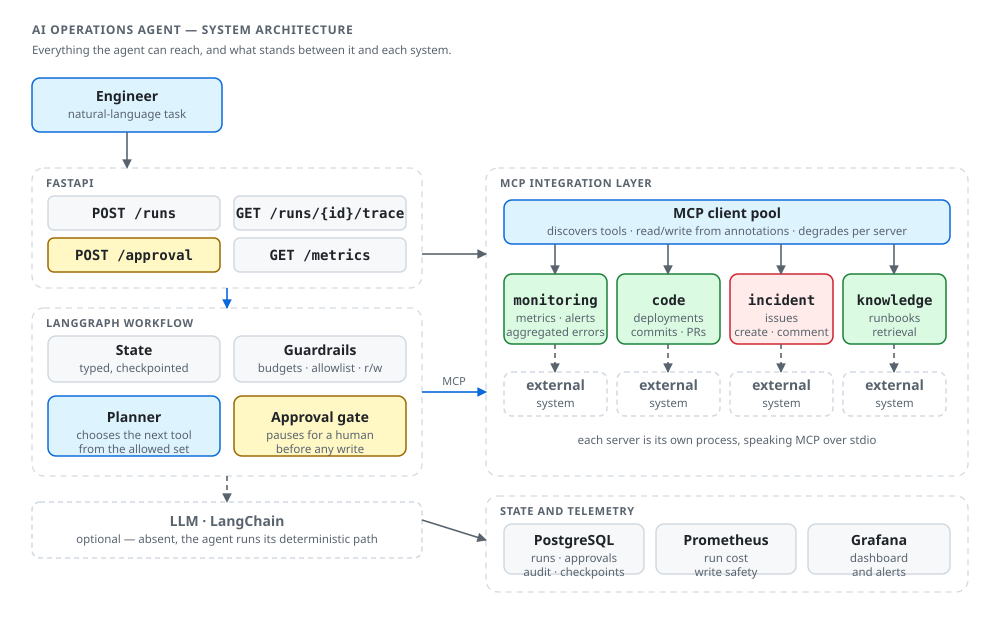
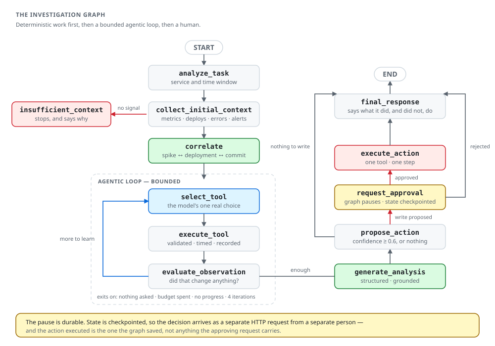
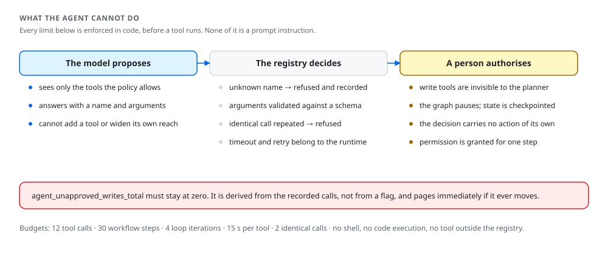

<div align="center">

# AI Operations Agent

**Агент, который расследует инциденты в backend-сервисах: сам решает, куда посмотреть,
собирает данные из четырёх систем, сопоставляет их — и не меняет ничего без человека.**

[](https://github.com/SlavaKlkv/ai-operations-agent/actions/workflows/ci.yml)
[](https://www.python.org/)
[](https://langchain-ai.github.io/langgraph/)
[](https://modelcontextprotocol.io/)
[](LICENSE)

</div>

---

Инженер пишет одну фразу:

> «После последнего релиза billing-service резко выросло количество 5xx. Разберись, что
> произошло, и подготовь issue.»

Дальше обычно начинается получасовое переключение между Grafana, логами, историей
деплоев, репозиторием и трекером задач. Этот сервис проходит тот же путь сам и
возвращает разбор, в котором каждое утверждение привязано к вызову инструмента, который
его добыл, — а issue создаёт только после того, как человек прочитал текст и согласился.

<picture>
  <source media="(prefers-color-scheme: dark)" srcset="docs/assets/architecture-dark.svg">
  
</picture>

## Содержание

- [Чем это отличается от чат-бота](#чем-это-отличается-от-чат-бота)
- [Как устроен процесс расследования](#как-устроен-процесс-расследования)
- [Что агенту не позволено](#что-агенту-не-позволено)
- [Быстрый старт](#быстрый-старт)
- [Демонстрация: от жалобы до issue](#демонстрация-от-жалобы-до-issue)
- [HTTP API](#http-api)
- [MCP как слой интеграции](#mcp-как-слой-интеграции)
- [Кэш обращений к внешним системам](#кэш-обращений-к-внешним-системам)
- [Работа без модели](#работа-без-модели)
- [Оценка агента](#оценка-агента)
- [Наблюдаемость](#наблюдаемость)
- [Конфигурация](#конфигурация)
- [Разработка](#разработка)
- [Структура проекта](#структура-проекта)
- [Принятые решения](#принятые-решения)
- [Чего здесь нет и почему](#чего-здесь-нет-и-почему)
- [Лицензия](#лицензия)

## Чем это отличается от чат-бота

Чат-бот — это `запрос → модель → текст`. Здесь другой контур:

```
запрос → решение → инструмент → наблюдение → новое решение → …
       → анализ → предложение → подтверждение человеком → действие
```

Разница не в количестве шагов, а в том, где принимаются решения.

| | Обычный LLM-воркфлоу | Этот агент |
|---|---|---|
| Состояние | живёт в истории сообщений | явный типизированный `AgentState`, сохраняемый в чекпоинт |
| Выбор инструмента | модель зовёт что угодно | модель выбирает из разрешённого набора, реестр решает, можно ли |
| Аргументы | как получится | Pydantic-схема, невалидные не доходят до провайдера |
| Остановка | «модель решила, что хватит» | бюджеты вызовов, шагов и итераций в коде |
| Доказательства | модель пишет их сама | список собирается из фактических вызовов, выдуманные ссылки отбрасываются |
| Запись во внешнюю систему | вызов инструмента | граф останавливается и ждёт решения человека |

Ключевой принцип: **если шаг можно сделать детерминированным кодом, модель для него не
нужна.** Поиск всплеска ошибок — это арифметика, сопоставление деплоя со всплеском —
сравнение таймстемпов. Модель нужна там, где нужен язык и суждение: понять задачу, выбрать
следующий источник, объяснить результат.

## Как устроен процесс расследования

<picture>
  <source media="(prefers-color-scheme: dark)" srcset="docs/assets/workflow-dark.svg">
  
</picture>

Три свойства графа держатся конструкцией, а не инструкцией в промпте:

1. **Детерминированная работа идёт первой.** Базовый контекст и корреляция выполняются до
   того, как модель вообще спрашивают, — планировщик рассуждает о фактах, а не о том, как
   их добыть.
2. **У каждого цикла есть выход, которым модель не управляет.** Возврат к `select_tool`
   защищён маршрутизирующей функцией, проверяющей бюджеты и прогресс. Планировщик может
   только сократить цикл, не продлить.
3. **Модель необязательна.** Без ключа каждый узел работает по детерминированной ветке.

## Что агенту не позволено

<picture>
  <source media="(prefers-color-scheme: dark)" srcset="docs/assets/guardrails-dark.svg">
  
</picture>

Отдельно про запись. Перед `create_issue` должны выполниться два независимых условия:

- человек подтвердил решение — строка `approvals` создаётся **до** действия и является
  тем, что его санкционирует;
- подтверждённое содержимое — то самое, что человеку показали: запрос на подтверждение
  несёт только «да/нет» и имя решающего, а выполняется то, что граф сохранил в чекпоинт.

Права записи выдаются на один шаг и сужаются до одного инструмента. Счётчик
`agent_unapproved_writes_total` вычисляется из журнала вызовов и должен вечно стоять на
нуле; любое движение — инцидент безопасности, на который настроен алерт.

## Быстрый старт

Нужны Docker и [uv](https://docs.astral.sh/uv/).

```bash
git clone https://github.com/SlavaKlkv/ai-operations-agent.git
cd ai-operations-agent
cp .env.example .env          # ANTHROPIC_API_KEY можно оставить пустым

make install                  # venv и зависимости
make up                       # PostgreSQL и Redis
make migrate                  # схема БД
make token EMAIL=you@example.com APPROVE=1   # токен показывается один раз
make run                      # http://localhost:8000/docs
```

Без Docker и без базы тоже работает — прогон оценки не требует ничего, кроме зависимостей:

```bash
make eval
```

## Демонстрация: от жалобы до issue

Синтетический мир, встроенный в репозиторий, описывает реальный инцидент:
в 14:27 UTC выкатывается `billing-service v1.8.4`, в 14:32 доля 5xx прыгает с 0.4 % до
11 %. Рядом лежат две ловушки: посторонний сервис, задеплоенный в 14:30 — то есть **после**
начала инцидента, — и свежий, но безобидный коммит.

**1. Запустить расследование.**

```bash
export TOKEN=aoa_…   # из `make token`

curl -sX POST localhost:8000/runs \
  -H "authorization: Bearer $TOKEN" \
  -H 'content-type: application/json' \
  -d '{"task":"После последнего релиза billing-service резко выросло количество 5xx. Разберись и подготовь issue."}'
```

Ответ приходит со статусом `awaiting_approval` — агент нашёл причину и остановился:

```jsonc
{
  "status": "awaiting_approval",
  "analysis": {
    "service": "billing-service",
    "incident_start": "2026-03-17T14:32:00Z",
    "confidence": 0.9,
    "suspected_causes": [{
      "statement": "billing-service v1.8.4 introduced the failure: it shipped 5 min before
                    the error rate rose 29x, and 9f2c41ab changes the failing code path",
      "confidence": 0.9
    }]
  },
  "pending_approval": {
    "tool": "create_issue",
    "arguments": { "title": "Elevated errors in billing-service from 14:32 UTC", "body": "## Summary …" }
  }
}
```

Обратите внимание, чего в ответе нет: `search-service v3.1.0`. Деплой, случившийся после
начала инцидента, не может быть его причиной, и это отсекается кодом, а не рассуждением.

**2. Посмотреть, как он к этому пришёл.**

```bash
curl -s localhost:8000/runs/$RUN_ID/trace -H "authorization: Bearer $TOKEN"
```

Трассировка — это узлы, вызовы инструментов, аргументы, краткие результаты и точки
ветвления. Скрытых рассуждений модели там нет намеренно: доказательство — то, что агент
сделал, а не то, что он «думал».

**3. Подтвердить или отклонить.**

```bash
curl -sX POST localhost:8000/runs/$RUN_ID/approval \
  -H "authorization: Bearer $TOKEN" \
  -H 'content-type: application/json' \
  -d '{"approved": true, "note": "согласен, откатываем"}'
```

Обратите внимание, чего в теле запроса нет: имени решающего. Оно берётся из токена —
имя в теле запроса это подпись, а не удостоверение, и аудит, построенный на такой
подписи, ничего не стоит. Токен без права `can_approve` получит здесь `403`.

Только теперь issue создаётся. Отказ завершает запуск без изменений во внешних системах и
записывает причину в аудит.

## HTTP API

| Метод | Путь | Что делает |
|---|---|---|
| `POST` | `/runs` | Запускает расследование. Возвращает результат либо паузу с полным текстом предложенной записи |
| `GET` | `/runs` | Список запусков |
| `GET` | `/runs/{id}` | Запуск целиком: анализ, вызовы инструментов, ожидающее подтверждение |
| `GET` | `/runs/{id}/trace` | Восстановленный ход выполнения: узлы, ветвления, инструменты |
| `POST` | `/runs/{id}/approval` | Решение человека. Требует права `can_approve`; `409`, если запуск не ждёт решения |
| `GET` | `/mcp/servers` | Подключённые MCP-серверы и обнаруженные инструменты. `503` при деградации |
| `GET` | `/metrics` | Метрики Prometheus |
| `GET` | `/health` | Живость и durable-ли пауза подтверждения |

Интерактивная документация — `/docs`.

Все эндпоинты запусков требуют `Authorization: Bearer <токен>`; `/health` и `/metrics`
открыты — проба готовности, которой нужен секрет, рано или поздно окажется настроена
неправильно, а содержимого расследований она не раскрывает. Токены выпускаются командой,
а не эндпоинтом: эндпоинт, выдающий токены, — это эндпоинт, у которого их попросит тот,
кто его найдёт. Хранится только SHA-256 от токена.

| Право | Что можно |
|---|---|
| действующий токен | запускать расследования, читать запуски и трассировки |
| `can_approve` | дополнительно — подтверждать запись во внешнюю систему |

## MCP как слой интеграции

Четыре собственных MCP-сервера, каждый — отдельный процесс, говорящий по протоколу через
stdio:

| Сервер | Инструменты | Доступ |
|---|---|---|
| `monitoring` | `get_service_metrics`, `get_error_rate`, `get_recent_alerts`, `get_error_groups` | чтение |
| `code` | `get_recent_deployments`, `get_commits`, `get_pull_request` | чтение |
| `incident` | `search_issues`, `get_issue`, `create_issue`, `add_issue_comment` | чтение + **запись** |
| `knowledge` | `search_runbooks`, `get_runbook` | чтение |

Они разделены не для красоты: в реальности это четыре разные системы, они не принадлежат
одному вендору, не падают вместе и не заслуживают одинаковых прав.

Существенная деталь: **MCP не заменяет контракт инструментов агента**. MCP-провайдеры
реализуют ровно те же протоколы адаптеров, что и мок-провайдеры, поэтому реестр
инструментов, схемы и ограничения остаются нашими. Если бы инструменты агента порождались
из того, что рекламируют серверы, сервер мог бы расширить свои полномочия правкой
собственного манифеста. Тест `tests/mcp/test_graph_over_mcp.py` проверяет именно это: один
и тот же граф на моках и на серверах даёт совпадающие вывод и последовательность вызовов.

Read или write определяется не по имени инструмента, а по аннотации `read_only_hint`,
которую сервер объявляет о себе сам. Отсутствие аннотации трактуется как запись: безопасный
путь не должен зависеть от того, вспомнил ли сервер себя описать.

Деградация устроена по-разному для разных серверов: `knowledge` объявлен необязательным, и
его недоступность не мешает расследованию; недоступность `monitoring` роняет только те
вызовы, которым он был нужен, а не процесс.

### Кэш обращений к внешним системам

Агент задаёт внешним системам одни и те же вопросы: два расследования одного сервиса с
разницей в минуты запрашивают то же окно метрик и тот же список деплоев. Результаты
read-инструментов кладутся в Redis на минуту.

Три правила не дают этому стать опасным: кэшируются **только чтения** — у записи есть
эффект, а эффект нельзя отдать из кэша, и решает это класс доступа, а не имя инструмента;
записи живут недолго, потому что данные мониторинга за окно, включающее «сейчас», ещё
меняются; недоступный Redis — это промах, а не ошибка. Вызов, отданный из кэша, помечается
в журнале (`cached: true`), чтобы оценка отличала дешёвый прогон от быстрого.

## Работа без модели

`ANTHROPIC_API_KEY` можно не задавать. Тогда:

- планировщик работает по набору правил, закрывающих пробелы в данных;
- итоговый разбор рендерится из доказательств детерминированным кодом;
- всё остальное — граф, инструменты, ограничения, подтверждение — работает как обычно.

Это не заглушка, а рабочий режим и одновременно базовая линия: план, который не лучше
эвристики, не стоит вызова API. Тот же механизм отрабатывает и при сбое провайдера —
запуск деградирует, а не падает, и это видно в метрике `agent_llm_calls_total{outcome="error"}`.

## Оценка агента

Три сценария, которые спорят друг с другом:

| Сценарий | Что в данных | Правильный ответ |
|---|---|---|
| `release-caused-incident` | релиз за 5 минут до всплеска изменил падающий файл | назвать `v1.8.4` и коммит, предложить issue |
| `dependency-degradation` | ошибки и задержки растут, свежих релизов нет | сказать, что ни один деплой этого не объясняет |
| `no-incident` | сервис здоров, жалоба ложная | сообщить, что причины не найдено, и ничего не предлагать |

Агент, который сопоставляет «ошибки → виноват последний деплой», проходит первый и валится
на остальных двух — ради этого они и существуют.

```bash
$ make eval
scenario                  result  tools steps waste      ms
──────────────────────────────────────────────────────────
release-caused-incident   PASS        8     9     0       9
dependency-degradation    PASS        7    10     0       7
no-incident               PASS        6     7     0       4
──────────────────────────────────────────────────────────
3/3 passed  mean 7.0 tool calls  mean 7 ms  0 wasted call(s)
```

Каждая проверка возвращает имя, вердикт и причину: `conclusion_correct`,
`no_false_attribution`, `confidence_calibrated`, `required_tools_called`,
`tool_call_efficiency`, `evidence_grounded`, `write_safety` и другие. Отдельно считаются
бесполезные вызовы — повторы и неудачи: это не критерий прохождения, но самый ясный признак
мечущегося агента. Прогон включён в CI отдельным job и возвращает ненулевой код при
регрессии.

`python -m app.evaluation --llm` прогоняет те же сценарии через настроенную модель,
`--json` выдаёт машиночитаемый результат для трендов.

## Наблюдаемость

```bash
make observability      # поднимает стек вместе с Prometheus и Grafana
```

Дашборд открывается на `http://localhost:3000/d/ai-operations-agent` и провижинится из
репозитория. Измеряется то, о чём спрашивают про агента, а не про веб-сервис:

| Метрика | Зачем |
|---|---|
| `agent_run_tool_calls` | во сколько вызовов обходится расследование — главный драйвер стоимости |
| `agent_runs_finished_total{status}` | чем заканчиваются запуски: выводом, паузой или отказом |
| `agent_run_confidence` | калибровка: скопление чуть выше порога предложения — признак подгонки |
| `agent_llm_calls_total{outcome}` | доступна ли модель; при сбоях агент молча уходит на детерминированную ветку |
| `agent_approvals_total{decision}` | растущая доля отказов означает, что агент предлагает лишнее |
| `agent_unapproved_writes_total` | **должен быть нулём**; алерт срабатывает сразу, без накопления |
| `agent_mcp_server_up` | состояние каждой интеграции |
| `agent_checkpointer_durable` | переживёт ли приостановленное подтверждение рестарт |

Правила алертов лежат в [`deploy/prometheus/rules.yml`](deploy/prometheus/rules.yml).

## Конфигурация

Всё через переменные окружения, полный список — в [`.env.example`](.env.example).

| Переменная | По умолчанию | Смысл |
|---|---|---|
| `ANTHROPIC_API_KEY` | — | Пусто → детерминированный режим |
| `LLM_MODEL` | `claude-opus-5` | Модель для планирования и разбора |
| `LLM_ENABLED` | `true` | Принудительно выключить модель |
| `MAX_TOOL_CALLS` | `12` | Бюджет вызовов на запуск |
| `MAX_WORKFLOW_STEPS` | `30` | Бюджет шагов графа |
| `TOOL_TIMEOUT_SECONDS` | `15` | Таймаут одного вызова |
| `AUTH_ENABLED` | `true` | Выключить только для локальной разработки; видно в `/health` |
| `MCP_ENABLED` | `true` | Выключить → in-process мок-провайдеры вместо MCP-серверов |
| `CACHE_ENABLED` | `true` | Кэш результатов read-инструментов в Redis |
| `CACHE_TTL_SECONDS` | `60` | Коротко намеренно: окно, включающее «сейчас», ещё движется |
| `CHECKPOINTER` | `postgres` | `memory` не переживает рестарт: пауза подтверждения потеряется |
| `POSTGRES_*`, `REDIS_URL` | см. пример | Хранилища |

## Разработка

```bash
make check        # линт, тесты, оценка — всё, что гоняет CI
make test         # pytest с покрытием
make lint         # ruff check и format --check
make format       # автоисправление
```

Тесты сгруппированы по подсистемам: `tests/agent`, `tests/agent/tools`, `tests/mcp`,
`tests/api`, `tests/evaluation`, `tests/observability`, `tests/adapters`. Ни один тест не
ходит в сеть: MCP-серверы поднимаются in-process через настоящий `mcp.Client` — транспорт
другой, но discovery, JSON-RPC, валидация схем и отображение ошибок настоящие. Модель
заменяется `ScriptedChatModel`, который является полноценным `BaseChatModel`, поэтому
`bind_tools` и `with_structured_output` ведут себя как в бою.

Схемы в этом README генерируются: `python tools/diagrams/render.py`. Геометрия описана
один раз, меняется только палитра — иначе светлая и тёмная версии неизбежно разъехались бы.

## Структура проекта

```
app/
  agent/          граф, состояние, планировщик, ограничения, чекпоинты
    nodes/        узлы: анализ задачи, сбор, корреляция, цикл, разбор, действие
    tools/        контракт инструмента, схемы, каталог, исполнитель
  adapters/       протоколы провайдеров; мок- и MCP-реализации
  mcp/            MCP-клиент, конфигурация серверов, пул соединений
  mcp_servers/    четыре собственных MCP-сервера
  evaluation/     сценарии, метрики качества, прогон
  observability/  метрики Prometheus и трассировка
  api/            HTTP-слой
  db/, services/  схема и персистентность запусков
deploy/           конфигурация Prometheus и Grafana
tools/diagrams/   генератор SVG-схем
```

## Принятые решения

Несколько мест, где выбор был неочевиден, и почему сделано именно так.

**LangChain взят точечно, а не как каркас.** Из него используются три вещи: интерфейс
чат-модели, `bind_tools` для провайдеро-независимого tool calling и
`with_structured_output` для ответов по схеме. Остальное приложение — обычный Python.

**Модель не пишет список доказательств.** Ей отдаётся схема `AnalysisDraft`, в которой
поля `evidence` вообще нет; доказательства подставляются из состояния. Сослаться на метрику,
которой она не видела, невозможно конструктивно. Ссылки, которых в собранных данных нет,
отбрасываются, а гипотеза без подтверждений теряет уверенность.

**Соединениями MCP владеет выделенная задача.** Транспорты построены на anyio cancel scope,
который обязан закрываться в той же задаче, где открыт. Открытие в одной задаче и закрытие
в другой — ровно то, что делает ASGI lifespan или teardown фикстуры, — даёт ошибку. Пул
владеет своими scope сам, поэтому его можно открывать и закрывать откуда угодно.

**Сериализация чекпоинтов ограничена явным allowlist типов.** По умолчанию LangGraph
восстановит из чекпоинта любой тип, а это строка в базе: тот, кто может в неё писать, выбирал
бы, что инстанцируется при чтении.

**Аргументы нормализуются в JSON как можно раньше.** Они хранятся в JSON-колонках, образуют
подпись вызова для детекта повторов и переживают round-trip через состояние — все три
ломаются, если внутрь просочится объект `datetime`.

## Чего здесь нет и почему

**Celery.** Расследование занимает миллисекунды на мок-провайдерах и единицы секунд через
MCP; синхронный ответ честнее показывает, сколько на самом деле стоит запуск. Очередь
станет нужна, когда появятся реальные бэкенды с многосекундными ответами — и тогда это
будет обоснованное изменение, а не технология, добавленная ради списка. Место для неё уже
подготовлено: запуск целиком описывается состоянием и чекпоинтом, так что перенос в
фоновую задачу не потребует переписывать граф.

**Полноценный RAG.** Knowledge-сервер отвечает на запросы по рунбукам лексическим
ранжированием в духе BM25. Для корпуса из нескольких документов с узким техническим
словарём это не компромисс: инженер может предсказать, что вернёт запрос, и это здесь
дороже, чем прирост полноты. Векторный поиск — отдельный проект, и он у меня отдельный.

**Автономные действия.** Агент не умеет откатывать релизы, перезапускать поды и трогать
инфраструктуру, хотя технически это такой же инструмент. Ограничение намеренное: система
ценна тем, что собирает и сопоставляет данные, а решение о вмешательстве остаётся за
человеком — и цена ошибки такого вмешательства несопоставима с ценой неверно
сформулированного issue.

## Лицензия

[MIT](LICENSE)
